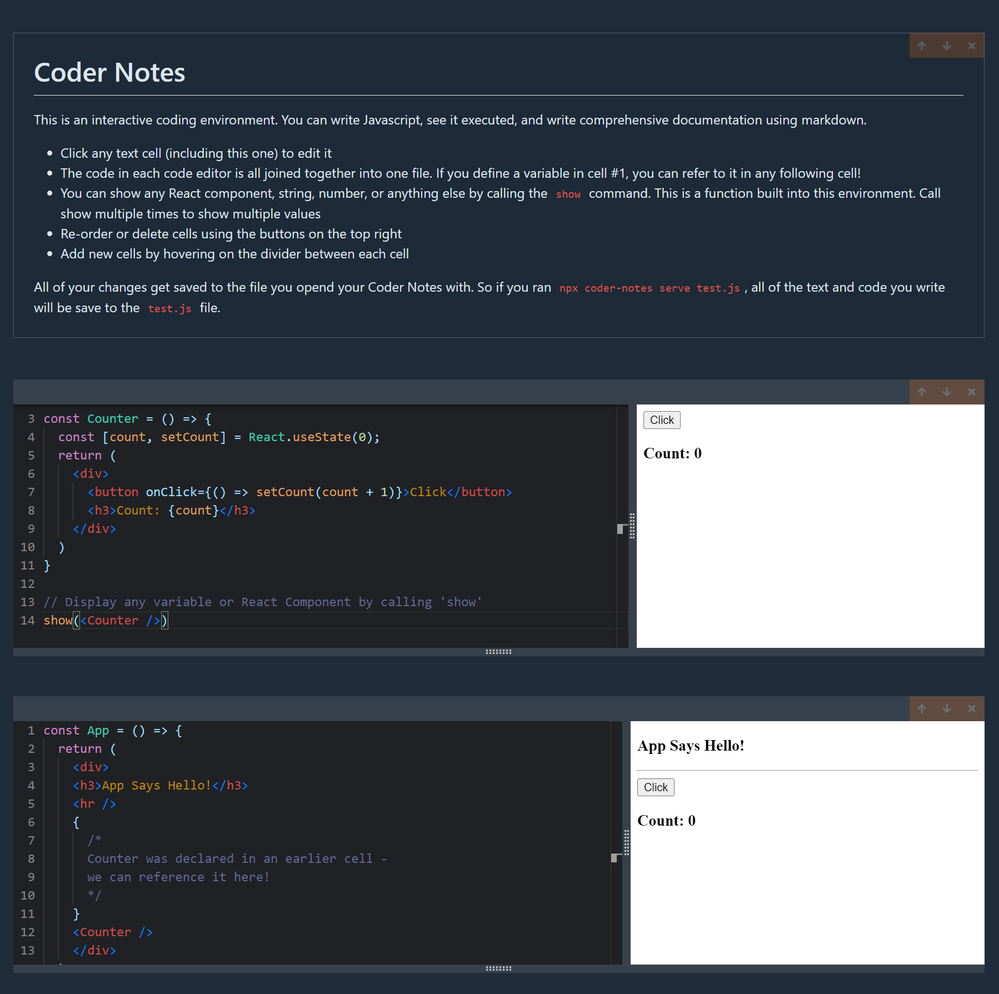

# Coder Notes

**This is an interactive coding environment. You can write Javascript, see it executed, and write comprehensive documentation using markdown.**

- Click any text cell (including this one) to edit it
- The code in each code editor is all joined together into one file. If you define a variable in cell #1, you can refer to it in any following cell!
- You can show any React component, string, number, or anything else by calling the `show` command. This is a function built into this environment. Call show multiple times to show multiple values
- Re-order or delete cells using the buttons on the top right
- Add new cells by hovering on the divider between each cell

All of your changes get saved to the file you opend your Coder Notes with. So if you ran `npx coder-notes serve test.js -p 5000`, all of the text and code you write will be saved to the `test.js` file. Additionally you have the option to specify a port to run the application on.

